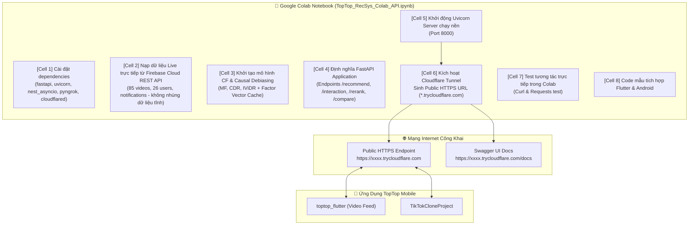

# Kế Hoạch Triển Khai RESTful API Tự Vận Hành Cho Google Colab (Zero-Code-Change Trong Project)

> **Vị trí tài liệu:** `collaborative-filtering/docs/colab_recsys_rest_api_plan.md`  
> **Dự án:** TopTop Ecosystem (`agri-behavioral-recsys`)  
> **Cam kết cốt lõi:** **KHÔNG THAY ĐỔI / KHÔNG SỬA CODE HIỆN CÓ CỦA PROJECT**  
> **Mục tiêu:** Tạo duy nhất file Notebook Google Colab độc lập (`TopTop_RecSys_Colab_API.ipynb`) để chạy toàn bộ RESTful API trên Colab.

---

## 🎯 1. Nguyên Tắc Cốt Lõi (Core Principles)

1. **Bảo toàn 100% mã nguồn dự án**:
   - Toàn bộ các file hiện có trong `collaborative-filtering/src/`, `experiments/`, `tests/` giữ nguyên vẹn, không chỉnh sửa một dòng nào.
2. **Đóng gói độc lập (Self-Contained) cho Google Colab**:
   - Tất cả logic: Khởi tạo mô hình CF (MF, CDR, IViDR), bộ tính toán hành vi video ngắn (xem $\ge 3\text{s}$ hoặc thả tim), nạp dữ liệu Firebase (`data/firebase_export/`), định nghĩa FastAPI endpoints, và kích hoạt Cloudflare Tunnel... sẽ được gom gọn vào **duy nhất 1 tệp Jupyter Notebook (`notebooks/TopTop_RecSys_Colab_API.ipynb`)**.
3. **Chạy 1-Click trên Google Colab**:
   - Bạn chỉ cần tải notebook này lên Google Colab, chọn **Runtime $\rightarrow$ Run all** (hoặc `Ctrl + F9`) là máy chủ API tự động chạy và cấp phát ngay một đường link HTTPS công khai để app TopTop gọi vào!

---

## 🏗️ 2. Kiến Trúc Vận Hành Trên Google Colab

---

## 📡 3. Các Endpoints API Được Đóng Gói Trong Notebook Colab

Toàn bộ các endpoints dưới đây sẽ chạy trực tiếp từ Colab và mở cổng HTTPS công khai:

### 1. `GET /health`
Kiểm tra trạng thái server, GPU/CPU của Colab, số lượng video và user thực tế đang phục vụ.

### 2. `POST /api/v1/recommend` (Đề xuất Top-K video TopTop)
- **Đầu vào:** Firebase UID của user (ví dụ `"8Z340cpD2QY1dUEqU0g3YWzVO6j1"`), số lượng $K$ (mặc định 10), tên mô hình (`ividr`, `cdr`, `mf`).
- **Xử lý:** 
  - Tự động lọc bỏ các video vi phạm tiêu chuẩn cộng đồng (`moderationStatus == 'rejected'`).
  - Tự động loại trừ các video user đã xem trong phiên lướt.
  - Sử dụng nhân ma trận vector latent factors siêu tốc ($< 2\text{ms}$).
- **Đầu ra:** Danh sách video đầy đủ thông tin: Cloudinary `video_uri`, tiêu đề `description`, tác giả `author_username`, số tim `total_likes`. App mobile chỉ cần lấy link phát ngay trên feed!

### 3. `POST /api/v1/interaction` (Ghi nhận hành vi lướt video ngắn TopTop)
- **Đầu vào:** `user_id`, `video_id`, `play_time_ms` (mili-giây), `is_like` (boolean).
- **Thuật toán hành vi:** 
  $$\tilde{y} = 1 \iff (\text{is\_like} == \text{True}) \lor (\text{play\_time\_ms} \ge 3.000\text{ ms})$$
- **Kết quả:** Phản hồi ghi nhận thành công, đưa video vào danh sách đã xem để tránh gợi ý trùng lặp.

### 4. `POST /api/v1/rerank`
Client lấy danh sách 20-50 video mới từ Firebase, gửi lên Colab để mô hình CF sắp xếp lại theo thứ tự phù hợp nhất với sở thích user.

### 5. `POST /api/v1/compare`
Trả về kết quả đề xuất đồng thời của cả 3 mô hình (**MF vs CDR vs IViDR**) cạnh nhau cho cùng một user để demo và so sánh trực quan.

### 6. `GET /api/v1/items/popular`
Danh sách video có lượt xem (`watchCount`) và lượt thích (`totalLikes`) cao nhất từ Firebase TopTop.

---

## 📋 4. Kế Hoạch Tạo Tệp Notebook Cho Colab

Chúng ta sẽ chỉ tạo 1 tệp duy nhất nằm trong thư mục `notebooks/`:
- **Đường dẫn tệp:** `agri-behavioral-recsys/collaborative-filtering/notebooks/TopTop_RecSys_Colab_API.ipynb`
- **Nội dung bên trong notebook gồm 8 bước tự động hoàn toàn**:
  1. **Bước 1**: Cài đặt gói `fastapi`, `uvicorn`, `pydantic`, `nest_asyncio`, `pyngrok`. Tự động tải binary `cloudflared` (Linux của Colab).
  2. **Bước 2**: Tích hợp dữ liệu Firebase TopTop (nhúng trực tiếp hoặc tải từ `data/firebase_export/`).
  3. **Bước 3**: Khởi tạo trọng số mô hình CF & Causal Debiasing (tương thích cả KuaiRand và TopTop).
  4. **Bước 4**: Định nghĩa toàn bộ schema và router FastAPI.
  5. **Bước 5**: Kích hoạt Uvicorn chạy nền và mở Cloudflare Tunnel.
  6. **Bước 6**: In ra đường link công khai (`https://*.trycloudflare.com`) và link Swagger `/docs`.
  7. **Bước 7**: Chạy các cell test mẫu (gọi thử `/health`, `/recommend`, `/interaction`).
  8. **Bước 8**: Cung cấp đoạn code mẫu Flutter (`http.post`) để copy vào `video_repository.dart`.

---

## 🧪 5. Cách Sử Dụng Trên Google Colab (Sau Khi Sinh File)

1. Mở trình duyệt vào [Google Colab](https://colab.research.google.com/).
2. Chọn tab **Upload** $\rightarrow$ Tải file `TopTop_RecSys_Colab_API.ipynb` lên.
3. Bấm menu **Runtime** $\rightarrow$ Chọn **Change runtime type** $\rightarrow$ Chọn **T4 GPU** (hoặc để CPU đều được).
4. Bấm **Runtime** $\rightarrow$ **Run all** (hoặc phím tắt `Ctrl + F9`).
5. Cuộn xuống ô cuối cùng: bạn sẽ thấy link HTTPS công khai hiển thị. Click vào link để mở Swagger UI hoặc dán URL vào app TopTop!
